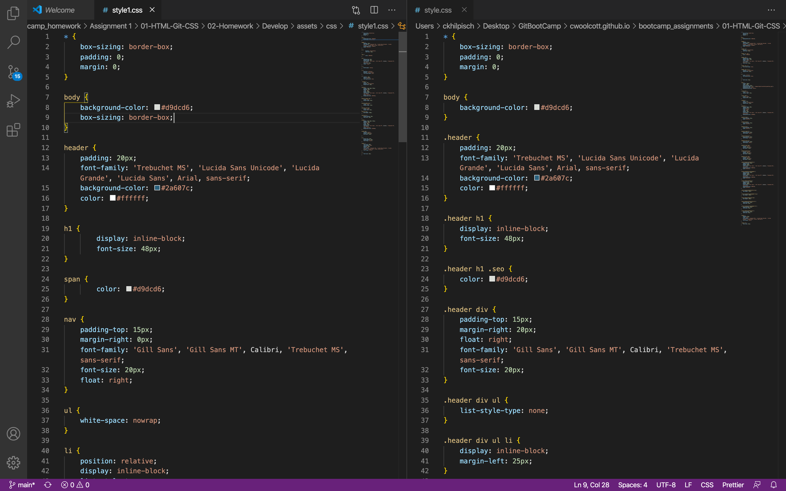
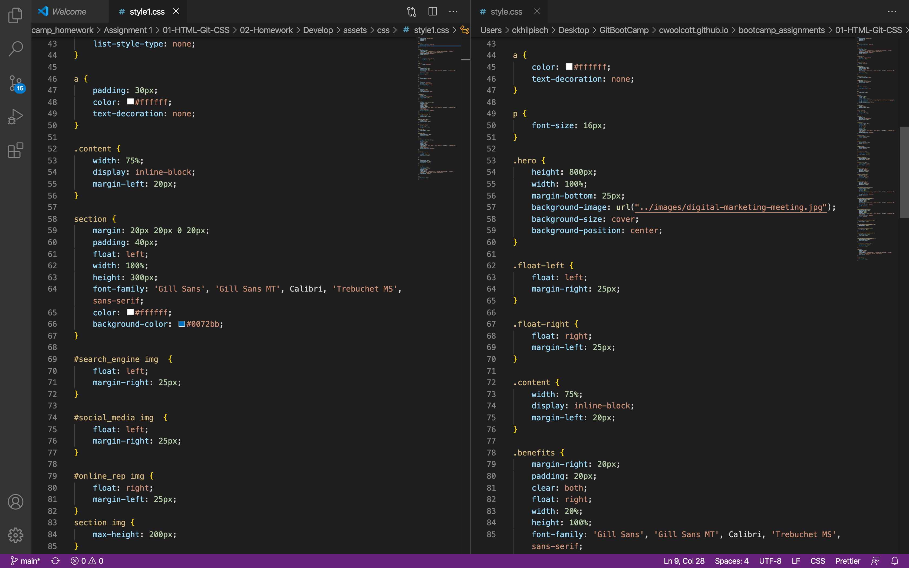
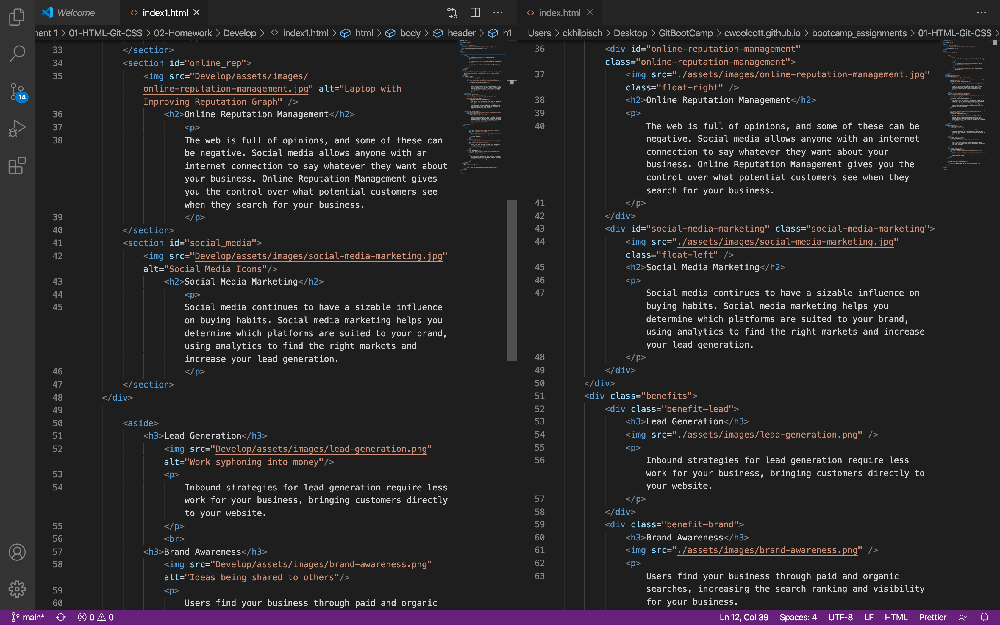

# BC_homework1
# Assignment 1: Refractoring Code:
For my first assignment I was tasked with taking an existing page for a marketing company and refactoring the code to make the page more accesible while still maintaining the current state of the page.  Increasing accessibility will make it a more inclusive website.  It will also help increase the search engine optimization for the webiste which positions the company for more visibility on the web.  

## Usage
The page looks the same as the original, with the added benefit of working links in the navbar and explanations of the images.

## Visuals

Here is a comparison of the codes:  My code is on the left, with the original on the right.

## Link to Commits:

I ran into some Git issues, so my original commits are here:
This is a link to my commits github.com/ckhilpisch/bootcamp_homework1/commits/main
 
## Deployed Site:

https://ckhilpisch.github.io/BC_homework1/

## Contact Me:
Carolyn Hilpisch 
ckhilpisch@gmail.com

## License:
MIT

